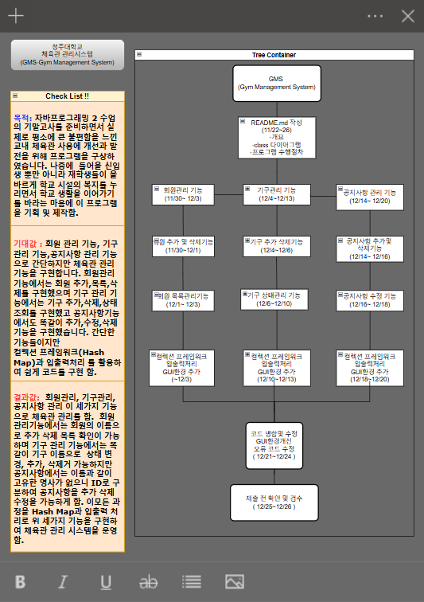

# 🏋️ 체육관 회원 관리 시스템 (GMS: Gym Membership Management System) 🏋️‍♀️

---

## 1️⃣ 개요  

### 🎯 1.1. 목적  
학교 체육관 회원 및 기구 관리 시스템은 **회원 관리**, **기구 관리**, **공지사항 알림** 기능을 통합하여  
운영 효율성을 높이고 체계적인 관리를 지원하는 프로그램입니다.  

**💡 배경**:  
- 🏫 교내 체육관(기숙사, 군사학과, 보건대)은 사설 헬스장에 비해 낙후된 시설과 관리 문제를 겪고 있습니다.  
- 📈 지속적인 관리와 회원 유입을 위해 자동화 시스템 구축이 필요합니다.  

**📌 목표**:  
- ✅ 체육관 운영 효율성 증대  
- ✅ 관리자의 업무 부담 감소  
- ✅ 지속적인 회원 유입  

---

### 👥 1.2. 대상  

1. **관리자**: 🛠️ 회원 및 기구 데이터 관리, 공지사항 체계적 전달  
2. **이용자(재학생/신입생)**: 📢 공지사항 확인 및 회원 서비스 이용  
3. **개발자**: 💻 실습용으로 프로그램 확장 가능  

---

## 2️⃣ 프로그램의 중요성 및 필요성  

### 🔑 2.1. 중요성  

 학교 체육관 관리는 무료로 운영되지만, 기구 파손·분실 등의 문제로 운영에 어려움을 겪고 있습니다.  
**체계적인 데이터 관리**와 **자동화 시스템**으로 효율성을 개선할 수 있습니다.  

**💼 주요 기능**:  
- 🔒 **출입 관리**: 모바일 및 학생증 인증  
- 🏋️‍♂️ **기구 관리**: 상태 파악 및 공지  
- 🗂️ **정확한 데이터**: 빠르고 간편한 조회 및 수정  

### 🔧 2.2. 필요성  
- 📝 회원 등록·수정·삭제를 간편화  
- 🛠️ 기구 상태(수량·사용 가능 여부) 관리  
- 📢 공지사항 알림으로 관리자와 이용자 간 원활한 소통  
- 🆕 신입생들의 체육관 관련 질문 해결  

---

## 3️⃣ 주요 기능  

### 👤 회원 관리  
- 회원 등록, 수정, 삭제  
- 전체 회원 목록 조회  

### 🏋️‍♀️ 기구 관리  
- 기구 등록, 수정, 삭제  
- 기구 상태 및 수량 확인  
- 대여 및 반납 처리  

### 📢 공지사항 관리  
- 공지사항 작성 및 수정  
- 체육관 이용자에게 공지사항 전송  

---

## 4️⃣ 프로그램 수행 절차

### 클래스 다이어그램

---

## 5️⃣ 향후 발전 방향 🚀

-🗄️ 데이터베이스 연동: 대규모 데이터 저장 및 관리

-📱 청주대 모바일 앱 연동: 청주대 어플리케이션에서 체육시설 정보 확인 가능

-📱 학생 자치 기구와 협업: 당선된 2025년도 총학생회 측 공약과 협업 전망 
-    체육시설 보수및 시설확대에 대한 공약 실천 가능  

---

## 6️ 느낌점
이번 프로젝트는 제가 헬스장을 이용하며 느꼈던 불편함을 해결하고자 시작했습니다.

직접 "이런 기능을 추가하면 어떨까?",
 "저 기능은 불필요하지 않을까?" 
 고민하며 코드를 작성해 보니

객체지향 프로그래밍과 클래스 설계에 대한 이해도를 높일 수 있었습니다.

📘 교수님께서 자주 말씀하신 **"실제 적용 가능한 프로그램"**의 중요성을 몸소 느꼈습니다.
이번 프로젝트는 앞으로 나아갈 길에 큰 자양분이 될 것이라 확신합니다. 💪
